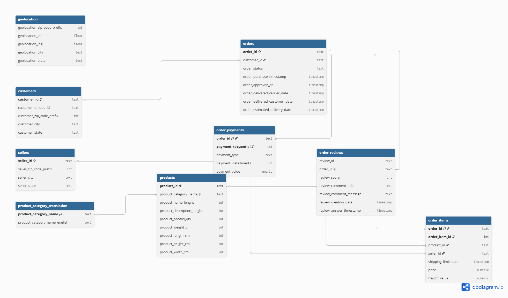
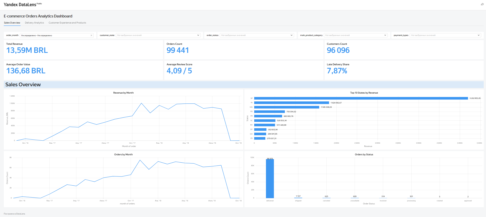
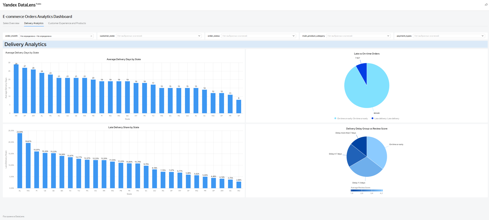
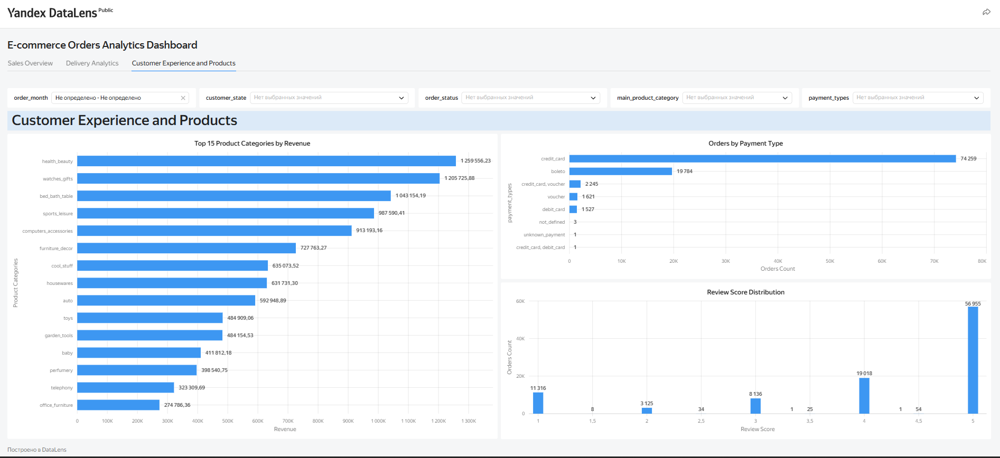

# E-commerce Orders Analytics

## О проекте

Проект посвящен анализу заказов e-commerce маркетплейса на основе [датасета Olist](https://www.kaggle.com/datasets/olistbr/brazilian-ecommerce).  
В рамках проекта данные были загружены в PostgreSQL, проверены на качество, объединены в аналитическую витрину и визуализированы в интерактивном дашборде DataLens.

Итоговая витрина построена на уровне заказа: **одна строка соответствует одному заказу**.

## Цель проекта

Собрать аналитическую витрину заказов маркетплейса, провести первичную проверку качества данных и построить дашборд для анализа:

- продаж и выручки;
- количества заказов и клиентов;
- статусов заказов;
- доставки и задержек;
- клиентских оценок;
- товарных категорий;
- способов оплаты.

## Данные

В проекте использован датасет Olist Brazilian E-Commerce Public Dataset.

В анализе использовались следующие таблицы:

- `customers` — данные о клиентах;
- `orders` — данные о заказах и статусах;
- `order_items` — товарные позиции в заказах;
- `order_payments` — данные об оплатах;
- `order_reviews` — оценки и отзывы клиентов;
- `products` — данные о товарах;
- `sellers` — данные о продавцах;
- `geolocation` — географические данные;
- `product_category_translation` — перевод категорий товаров.

## Модель данных

Основная таблица проекта - `orders`.  
Она связана с клиентами, товарными позициями, оплатами и отзывами.  
Товарные позиции дополнительно связаны с товарами, продавцами и справочником категорий.

ER-диаграмма модели данных:



## Этапы работы

### 1. Создание таблиц

На первом этапе была создана структура таблиц для загрузки исходных CSV-файлов в PostgreSQL.

Файл:

```text
sql/00_create_tables.sql
```

В скрипте описаны таблицы для заказов, клиентов, товаров, оплат, отзывов, продавцов, геолокации и перевода категорий.

### 2. Проверка качества данных

После загрузки данных была проведена первичная проверка качества.

Файл:

```text
sql/01_data_quality_checks.sql
```

Были выполнены следующие проверки:

* количество строк в каждой таблице после импорта;
* пропуски в ключевых полях;
* дубли идентификаторов заказов, клиентов, товаров и продавцов;
* корректность последовательности дат заказа, оплаты и доставки;
* отрицательные значения в ценах, стоимости доставки и оплатах;
* корректность оценок клиентов;
* связи между таблицами заказов, товаров, оплат, отзывов и клиентов;
* заказы без товаров, оплат и отзывов;
* категории товаров без перевода на английский язык.

В ходе проверки были обнаружены отдельные особенности данных:

* часть заказов не имеет отзывов, что является нормальной ситуацией;
* заказы без товарных позиций в основном относятся к статусам `unavailable`, `canceled` и `created`;
* был найден 1 доставленный заказ без записи об оплате;
* у части товаров отсутствует категория или перевод категории.

Эти случаи были зафиксированы и учтены при построении аналитической витрины.

### 3. Построение аналитической витрины

Для дальнейшего анализа была собрана итоговая витрина:

```text
orders_datamart
```

Файл:

```text
sql/02_build_orders_datamart.sql
```

Витрина построена на уровне заказа:

```text
1 строка = 1 заказ
```

Перед объединением таблиц были отдельно агрегированы:

* товарные позиции;
* оплаты;
* отзывы;
* категории товаров.

Такой подход позволяет избежать задвоения выручки и оплат при соединении таблиц.

В итоговую витрину вошли:

* данные заказа;
* данные клиента;
* регион клиента;
* статус заказа;
* дата заказа и месяц заказа;
* количество товаров;
* количество уникальных товаров;
* количество продавцов;
* основная категория товара;
* выручка заказа;
* стоимость доставки;
* сумма оплаты;
* тип оплаты;
* оценка клиента;
* флаг наличия отзыва;
* срок доставки;
* задержка доставки;
* флаг задержанной доставки.

### 4. Аналитические SQL-запросы

На основе витрины были написаны аналитические запросы.

Файл:

```text
sql/03_analytics_queries.sql
```

В запросах рассчитаны:

* общие KPI;
* динамика заказов и выручки по месяцам;
* накопительная выручка;
* рост выручки к предыдущему месяцу;
* распределение заказов по статусам;
* топ регионов по выручке;
* топ категорий по выручке;
* показатели доставки по регионам;
* связь задержки доставки и оценки клиента;
* распределение клиентских оценок;
* способы оплаты;
* сегменты клиентов по количеству заказов.

## Дашборд

Итоговый дашборд был построен в DataLens на основе аналитической витрины `orders_datamart`.

Дашборд состоит из трех разделов:

1. **Sales Overview** — обзор продаж, выручки, заказов, клиентов и статусов.
2. **Delivery Analytics** — анализ сроков доставки, задержек и региональных различий.
3. **Customer Experience and Products** — анализ клиентских оценок, категорий товаров и способов оплаты.

### Sales Overview



### Delivery Analytics



### Customer Experience and Products



## Ключевые метрики

По итоговой витрине были рассчитаны следующие показатели:

| Метрика              |   Значение |
| -------------------- | ---------: |
| Total Revenue        | 13,59M BRL |
| Orders Count         |     99 441 |
| Customers Count      |     96 096 |
| Average Order Value  | 136,68 BRL |
| Average Review Score |   4,09 / 5 |
| Late Delivery Share  |      7,87% |

## Основные выводы

1. Общая выручка составила **13,59 млн BRL** при **99 441 заказе** и **96 096 уникальных клиентах**.

2. Основная часть выручки приходится на несколько регионов. Наибольший вклад в продажи дают штаты **SP**, **RJ** и **MG**.

3. Большинство заказов имеет статус `delivered`. Остальные статусы, включая `canceled`, `unavailable`, `shipped` и `processing`, занимают значительно меньшую долю.

4. Доля заказов с задержкой доставки составила **7,87%**. Это важный показатель для анализа клиентского опыта.

5. Средняя оценка клиентов составила **4,09 из 5**, что говорит о достаточно высоком уровне удовлетворенности в целом.

6. Наиболее доходные категории товаров: `health_beauty`, `watches_gifts`, `bed_bath_table`, `sports_leisure`.

7. Основной способ оплаты заказов - `credit_card`. Второй по популярности способ - `boleto`.

## Стек

* PostgreSQL
* DBeaver
* SQL
* DataLens
* CSV
* GitHub

## Как воспроизвести проект

1. Скачать исходные CSV-файлы датасета Olist.
2. Создать таблицы с помощью скрипта:

```text
sql/00_create_tables.sql
```

3. Импортировать CSV-файлы в соответствующие таблицы PostgreSQL.
4. Запустить проверки качества данных:

```text
sql/01_data_quality_checks.sql
```

5. Построить аналитическую витрину:

```text
sql/02_build_orders_datamart.sql
```

6. Выполнить аналитические запросы:

```text
sql/03_analytics_queries.sql
```

7. Подключить витрину `orders_datamart` к DataLens или выгрузить ее в CSV.
8. Построить дашборд на основе рассчитанных метрик.

